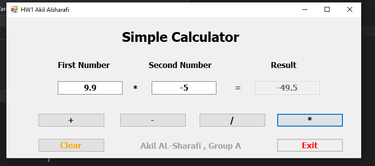

# واجب الطالب عقيل عبده محمد عقيل الشرفي
## الواجب رقم 1 المحاضرة 2

## وصف المشروع
هذا المشروع عبارة عن تطبيق حاسبة بسيط باستخدام Windows Forms في لغة C#. يسمح للمستخدم بإدخال رقمين واختيار العملية الحسابية (جمع، طرح، ضرب، قسمة) لعرض النتيجة.

## كيف يعمل البرنامج؟
1. أدخل الرقم الأول في حقل النص الأول.
2. أدخل الرقم الثاني في حقل النص الثاني.
3. اختر العملية الحسابية بالنقر على أحد الأزرار (+, -, *, /).
4. ستظهر النتيجة في الحقل الثالث.
5. يمكنك مسح الحقول بالنقر على زر "Clear" أو إغلاق البرنامج بالنقر على زر "Exit".

### ملاحظات
- لا يمكن ترك الحقول فارغة.
- في عملية القسمة، يجب أن يكون الرقم الثاني مختلفًا عن الصفر.

## صورة من التطبيق

